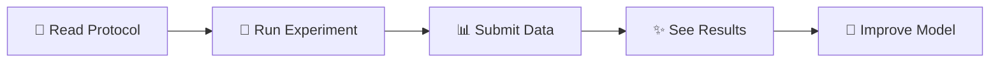

# Neighbly Home Physics Lab

<div align="center">

*"We shape our buildings, and afterwards our buildings shape us."*  
**— Alain De Botton, Architecture Of Happiness**

[](CONTRIBUTING.md)
[](https://github.com/yourusername/NeighblyHomePhysicsLab)

**Experimental physics platform for optimizing home spaces through data-driven insights**

</div>

---

## 🎯 Mission

> Bridging the gap between **physics**, **technology**, and **architectural design** by creating open-source models that help people optimize their living spaces. 

This research directly supports **[ArchNeighbly](https://t.me/Neighbly)** - an AI platform that gives personalized home organization advice based on real physics.

---

## 🔬 Active Experiments

<table>
<tr>
<td width="33%">

### Thermal Modeling
**Status:** 🚧 In Progress  
**Goal:** Create predictive models for heat distribution and energy loss in residential spaces  
**Applications:** Optimizing furniture placement, window treatments, and heating strategies

</td>
<td width="33%">

### Acoustic Comfort
**Status:** 📋 Planning  
**Goal:** Quantify sound propagation and noise reduction in home environments  
**Applications:** Designing quieter, more comfortable living spaces

</td>
<td width="33%">

### Airflow Analysis
**Status:** 📋 Planning  
**Goal:** Model natural and forced ventilation patterns for air quality improvement  
**Applications:** Optimizing room layouts for better air circulation

</td>
</tr>
</table>

---

## 🤝 Collaboration Framework

### 📊 Open Data Initiative
- **🔬 Standardized measurement protocols** for replicable experiments
- **✅ Community validation** - test our models in your own space  
- **🔗 Data sharing API** for researchers and developers

### 🚀 How to Contribute?



1. **🧪 Replicate experiments** using our protocols
2. **📈 Share your data** via standardized templates  
3. **🎯 Validate models** with your real-world results
4. **💡 Suggest improvements** to our methodologies

---

## 🛠️ Equipment & Methods

<div align="center">

### 💰 Budget-Conscious Approach
*All experiments designed to use **affordable, accessible equipment** (total budget: <$50)*

</div>

| Category | Tool | Cost | Purpose |
|----------|------|------|---------|
| 🌡️ **Temperature** | DIY sensors + smartphone | ~$15 | Heat mapping |
| 🔊 **Sound** | Smartphone apps | Free | Acoustic analysis |
| 💨 **Airflow** | Creative alternatives | ~$20 | Ventilation patterns |
| 📱 **Data Collection** | Smartphone camera | Free | Documentation |

### 🔧 Our Philosophy
- **🔓 DIY sensors and measurement tools**
- **📱 Smartphone-based data collection**  
- **💡 Creative low-cost alternatives to expensive lab equipment**

---

## 📈 Future Vision

```
🏠 Individual space optimization → 🏘️ Neighborhood patterns → 🏙️ Urban design insights
```

<div align="center">

**Technology Stack:**  
Physics models → AI recommendations → Community validation → Urban policy

</div>

---

## 📬 Contact & Collaboration

<div align="center">

**Interested in collaborating?**

Whether you're a **🔬 Researcher** • **🎓 Student** • **🏠 Homeowner** • **💻 Developer**

[](mailto:sarkovvitala@gmail.com)
[](https://t.me/Neighbly)

</div>

---

<div align="center">

**This project demonstrates that architecture begins not with grand visions,**  
**but with understanding the physics of the spaces we inhabit daily.**

---

*⭐ **Star this repo** if you believe in physics-driven home optimization!*  
*🔗 **Fork & contribute** to help build the future of smart living spaces*

---

[](https://github.com/yourusername)

</div>
